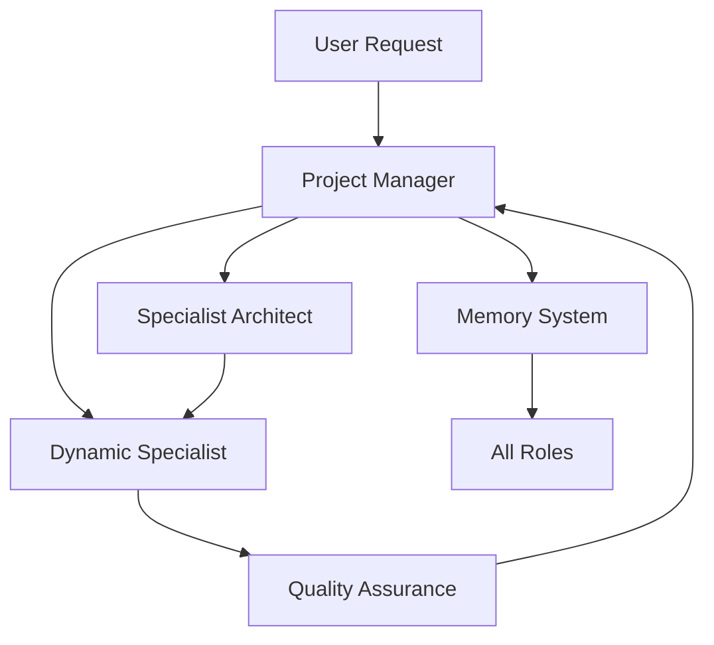
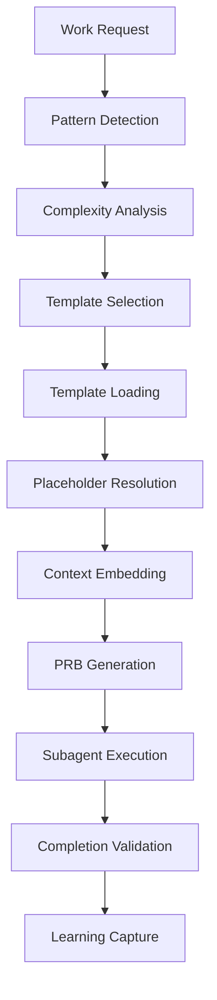
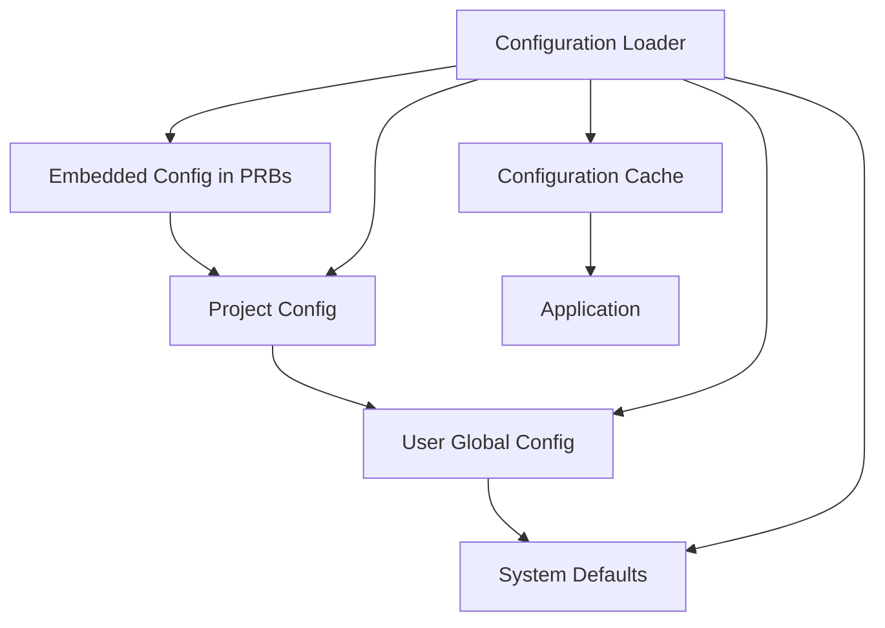
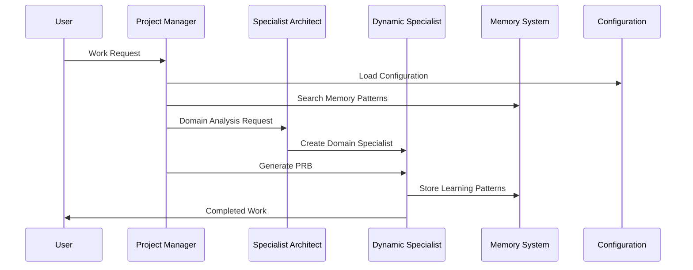

# System Architecture Overview

This document provides a comprehensive overview of the intelligent-claude-code system architecture, including its components, interactions, and design principles.

## Table of Contents

1. [System Overview](#system-overview)
2. [Core Components](#core-components)
3. [Virtual Team Architecture](#virtual-team-architecture)
4. [PRB Execution Engine](#prb-execution-engine)
5. [Memory System](#memory-system)
6. [Configuration Management](#configuration-management)
7. [Component Interactions](#component-interactions)
8. [Data Flow](#data-flow)
9. [Security Architecture](#security-architecture)
10. [Deployment Architecture](#deployment-architecture)

## System Overview

The intelligent-claude-code system is a **markdown-based AI-agentic framework** that transforms Claude Code into an intelligent virtual development team. It provides:

- **14 Core Specialized Roles** with behavioral patterns
- **Unlimited Dynamic Specialist Creation** for any technology domain
- **PRB-Driven Execution** with 5 complexity tiers
- **Memory-First Learning System** with pattern capture
- **Configuration-First Design** with hierarchy management
- **Project-Agnostic Framework** that adapts to any codebase

### System Nature Classification

The system operates as a **MARKDOWN-BASED AI-AGENTIC SYSTEM**, meaning:
- Primary artifacts are markdown files with behavioral patterns
- Agent coordination through natural language commands
- Configuration-driven behavior adaptation
- Memory-based learning and pattern application

## Core Components

### 1. Role System (`src/roles/`)

**Purpose:** Defines 14 specialized roles with behavioral patterns

**Core Roles:**
- `@PM` - Project coordination and task delegation
- `@Architect` - System architecture and technical design
- `@Developer` - Software implementation and feature development
- `@AI-Engineer` - AI/ML systems and behavioral patterns
- `@DevOps-Engineer` - CI/CD and deployment automation
- `@Security-Engineer` - Security reviews and compliance
- `@Database-Engineer` - Database design and optimization
- `@System-Engineer` - Infrastructure and system operations
- `@Web-Designer` - UI/UX design and user experience
- `@QA-Engineer` - Quality assurance and testing
- `@Backend-Tester` - Backend testing and API validation
- `@Requirements-Engineer` - Requirements analysis and documentation
- `@User-Role` - End-to-end testing and browser automation

**Dynamic Specialist Creation:**
- Unlimited creation of domain-specific specialists
- Pattern: `@{Domain}-{RoleType}` (e.g., @React-Developer, @AWS-Engineer)
- Created based on actual project needs, not predefined lists
- Always generated when technology expertise is needed

### 2. Behavioral Framework (`src/behaviors/`)

**Purpose:** Implements behavioral patterns and enforcement rules

**Key Components:**
- `prb-enforcement.md` - PRB system enforcement and validation
- `prb-auto-trigger.md` - Automatic PRB generation from work patterns
- `dynamic-specialist-creation.md` - On-demand specialist creation
- `story-breakdown.md` - PM + Architect collaboration patterns
- `memory-operations.md` - Learning and pattern storage
- `configuration-patterns.md` - Hierarchy management

**Shared Patterns (`src/behaviors/shared-patterns/`):**
- Template loading and enforcement
- Memory operations and storage
- Configuration hierarchy management
- Learning pattern capture
- Autonomy level behaviors

### 3. PRB System (`src/prb-templates/`)

**Purpose:** Product Requirement Blueprints for single-pass execution

**Template Hierarchy:**
- `nano-prb-template.yaml` (0-2 complexity points)
- `tiny-prb-template.yaml` (3-5 complexity points)
- `medium-prb-template.yaml` (6-15 complexity points)
- `large-prb-template.yaml` (16-30 complexity points)
- `mega-prb-template.yaml` (30+ complexity points)

**Template Features:**
- Complete context embedding (no runtime lookups)
- Configuration hierarchy resolution
- Memory pattern integration
- Best practices application
- Complexity-based selection

### 4. Command System (`src/commands/`)

**Purpose:** System initialization and management commands

**Key Commands:**
- `/icc-init-system` - Initialize virtual team system
- `/icc-system-status` - Check system health
- `/icc-search-memory` - Query memory patterns
- `/icc-create-prb` - Generate PRBs with templates
- `/icc-breakdown-story` - Story-to-PRB conversion

### 5. Installation System (`ansible/`)

**Purpose:** Automated deployment and configuration management

**Components:**
- `install.yml` - Installation playbook
- `uninstall.yml` - Removal playbook with data preservation
- `Makefile` - Installation orchestration
- MCP server integration and validation

## Virtual Team Architecture

### Role Interaction Model



### Task Delegation Flow

1. **User Request** → Natural language work request
2. **@PM Analysis** → Work complexity and domain analysis
3. **Specialist Architect Selection** → Domain-specific architect creation
4. **Collaboration** → PM + Architect determine optimal role assignment
5. **Dynamic Creation** → Create domain-specific specialist if needed
6. **PRB Generation** → Template-based execution plan
7. **Subagent Execution** → Specialist executes PRB with embedded context

### Role Assignment Decision Matrix

| Project Scope | Work Type | Assigned Role | Rationale |
|---------------|-----------|---------------|-----------|
| AI-AGENTIC | Behavioral Patterns | @AI-Engineer | System nature alignment |
| AI-AGENTIC | Memory Systems | @AI-Engineer | Domain expertise |
| AI-AGENTIC | DevOps Tasks | @DevOps-Engineer | Work type specialization |
| CODE-BASED | Implementation | @Developer | Code-focused work |
| CODE-BASED | Testing | @Backend-Tester | Quality assurance |
| ANY | Database Work | @Database-Engineer | Domain expertise |
| ANY | Security Review | @Security-Engineer | Security specialization |

## PRB Execution Engine

### Architecture Overview



### Template Resolution Process

1. **Context Gathering**
   - Load configuration hierarchy
   - Identify system nature and project scope
   - Search memory for relevant patterns
   - Query best practices for methodological guidance

2. **Placeholder Resolution**
   - Replace `[FROM_CONFIG]` with actual configuration values
   - Substitute `[PROJECT_ROOT]` with absolute project path
   - Resolve `[CURRENT_DATE]` with system date
   - Embed `[MEMORY_SEARCH:topic]` results

3. **Context Embedding**
   - Complete configuration object
   - Critical file references with content samples
   - Memory patterns and learning history
   - Best practices and methodological guidance

4. **Validation**
   - Verify no unresolved placeholders remain
   - Check all mandatory template sections present
   - Ensure configuration values are actual, not placeholders
   - Validate system nature alignment with role assignment

### Execution Lifecycle

```yaml
PRB Lifecycle:
  1. Creation:
     - Main agent context (full project access)
     - Template selection based on complexity
     - Complete placeholder resolution
     - Context embedding and validation
  
  2. Execution:
     - Subagent context (task-specific scope)
     - Self-contained PRB with embedded context
     - No runtime configuration lookups
     - Step-by-step execution validation
  
  3. Completion:
     - All 9 execution steps validated
     - Learning pattern capture
     - Memory storage of successful approaches
     - PRB moved to completed/ directory
```

## Memory System

### Architecture Design

The memory system implements **file-based learning storage** with:
- Version-controlled pattern persistence
- Topic-based organization
- Exponential aging and relevance scoring
- Proactive pattern generation and application

### Directory Structure

```
memory/
├── behavioral-patterns/     # Agent behavioral improvements
├── implementation-patterns/ # Technical implementation approaches
├── system-design/          # Architecture and design patterns
├── configuration/          # Configuration management patterns
├── security/              # Security implementation patterns
├── performance/           # Performance optimization patterns
└── entities/              # Structured learning entities
    ├── Learning/          # Learning pattern entities
    ├── Knowledge/         # Knowledge capture entities
    └── Pattern/           # Behavioral pattern entities
```

### Memory Operations

1. **Proactive Generation**
   - Auto-detect learning opportunities during all operations
   - Store configuration discoveries and access patterns
   - Capture successful workflow completions
   - Document issue resolution patterns

2. **Pattern Application**
   - Memory-first approach to all operations
   - Search relevant patterns before asking user
   - Apply high-relevance patterns automatically
   - Track pattern usage and effectiveness

3. **Learning Capture**
   - Store patterns from successful PRB execution
   - Capture PM + Architect collaboration approaches
   - Document dynamic specialist creation patterns
   - Record configuration optimization discoveries

### Security-Aware Storage

**Safe Storage Patterns:**
- Configuration file locations (not contents)
- Environment variable patterns (not values)
- Access methods and procedures
- Authentication workflows (not credentials)

**Blocked Storage:**
- Actual passwords, tokens, API keys
- Private keys and certificates
- Sensitive project details
- Personal information

## Configuration Management

### Hierarchy Architecture



### Configuration Levels

1. **Embedded Configuration** (Highest Priority)
   - PRB-specific overrides
   - Work context configurations
   - Temporary behavioral modifications

2. **Project Configuration**
   - `CLAUDE.md` project context
   - `config.md` project-specific settings
   - `.claude/config.md` hidden project configuration

3. **User Global Configuration**
   - `~/.claude/config.md` user-wide settings
   - Personal preferences and defaults
   - Cross-project behavioral patterns

4. **System Defaults** (Lowest Priority)
   - Built-in behavioral patterns
   - Framework default configurations
   - Fallback values for all settings

### Configuration Categories

```yaml
# Git Operations
git_privacy: true           # Strip AI mentions from commits
branch_protection: true     # Protect main branch from direct commits
default_branch: "main"      # Primary branch for operations

# Autonomy Levels
autonomy_level: "L2"        # L1=Manual, L2=Guided, L3=Autonomous
max_concurrent_subagents: 5 # Parallel execution limit

# Directory Structure
directory_structure:
  story_path: "stories"     # User stories location
  prb_path: "prbs"         # PRB storage location
  memory_path: "memory"     # Learning storage location

# System Behavior
memory_integration: true    # Enable memory system
specialist_creation: true   # Enable dynamic specialist creation
template_validation: true   # Enforce template compliance
```

## Component Interactions

### System Initialization Flow

1. **Installation Phase**
   ```
   ansible/install.yml → ~/.claude/ structure creation
                      → CLAUDE.md import line addition
                      → Template hierarchy deployment
                      → MCP server configuration
   ```

2. **System Activation**
   ```
   /icc-init-system → Configuration loading
                   → Memory system initialization
                   → Role system activation
                   → Command registration
   ```

3. **Runtime Operations**
   ```
   User Request → Pattern Detection → PRB Generation → Execution
              ↓
   Memory Search ← Configuration → Template Loading → Context Embedding
   ```

### Inter-Component Communication



### Data Flow Architecture

1. **Input Processing**
   - Natural language work requests
   - @Role command patterns
   - Configuration file updates
   - Memory pattern queries

2. **Processing Pipeline**
   - Pattern detection and classification
   - Configuration hierarchy resolution
   - Memory pattern search and application
   - Template selection and resolution
   - Context embedding and validation

3. **Output Generation**
   - PRB files with embedded context
   - Subagent execution coordination
   - Memory pattern storage
   - Learning capture and indexing

## Security Architecture

### Multi-Layer Protection

1. **Input Sanitization**
   - Sensitive data detection in memory operations
   - Configuration value validation
   - Template placeholder security checks
   - File path traversal prevention

2. **Access Control**
   - Project boundary enforcement
   - Memory access permissions
   - Configuration hierarchy isolation
   - Subagent working directory restrictions

3. **Data Protection**
   - Git privacy filter for AI mentions
   - Credential location storage (not values)
   - Configuration encryption for sensitive settings
   - Memory content sanitization

### Security Validation Process

```yaml
Security Checklist:
  - Memory Storage: Block sensitive patterns (tokens, passwords, keys)
  - File Operations: Constrain to project root boundaries
  - Configuration: Validate YAML syntax and value types
  - Git Operations: Apply privacy filters based on settings
  - Subagent Scope: Prevent unauthorized directory access
  - Template Resolution: Sanitize placeholder content
```

### Privacy Implementation

1. **Git Privacy Filter**
   ```bash
   # When git_privacy=true, automatically strip:
   - "Generated with Claude Code"
   - "Co-Authored-By: Claude <noreply@anthropic.com>"
   - All AI system mentions in commit messages
   ```

2. **Memory Privacy Protection**
   ```bash
   # Block storage of:
   - Actual credential values
   - Personal identifying information
   - Project-specific sensitive data
   - Temporary session information
   ```

3. **Configuration Security**
   ```yaml
   # Secure configuration patterns:
   credential_location: "~/.config/service/credentials"  # Location only
   environment_pattern: "$SERVICE_TOKEN"                # Pattern only
   access_method: "source ~/.bashrc && echo $TOKEN"     # Method only
   ```

## Deployment Architecture

### Installation Models

1. **User Scope Installation** (Default)
   ```
   ~/.claude/                   # User-wide configuration
   ├── modes/                   # Behavioral mode definitions
   ├── roles/                   # Role specifications
   ├── behaviors/               # Behavioral pattern library
   ├── prb-templates/           # Template hierarchy
   └── config.md                # User configuration
   
   project/                     # Project-specific deployment
   ├── CLAUDE.md                # Project context (with import)
   ├── memory/                  # Learning storage
   ├── prbs/                    # PRB execution files
   └── .claude/                 # Project overrides (optional)
   ```

2. **Project Scope Installation**
   ```
   project/                     # Everything within project
   ├── .claude/                 # Complete system installation
   │   ├── modes/
   │   ├── roles/
   │   ├── behaviors/
   │   └── prb-templates/
   ├── CLAUDE.md
   ├── memory/
   └── prbs/
   ```

3. **Remote Installation**
   - SSH-based deployment to remote hosts
   - Ansible automation for consistent setup
   - Support for both key and password authentication
   - Environment variable configuration for MCP servers

### System Dependencies

```yaml
Required Dependencies:
  - ansible-playbook: Installation automation
  - git: Version control operations
  - python: Configuration validation
  - bash: Shell command execution

Optional Dependencies:
  - gh: GitHub CLI for repository operations
  - node: MCP server execution environment
  - docker: Container-based development environments
```

### Environment Configuration

1. **Development Environment**
   ```bash
   make install                    # Local development setup
   /icc-init-system               # System initialization
   export AUTONOMY_LEVEL=L2       # Guided development mode
   ```

2. **Production Environment**
   ```bash
   make install HOST=prod USER=deploy  # Remote production setup
   export AUTONOMY_LEVEL=L3           # Autonomous operations
   export GIT_PRIVACY=true            # Enhanced privacy mode
   ```

3. **Testing Environment**
   ```bash
   make test                      # Automated testing
   make install TARGET_PATH=test  # Isolated test installation
   ```

## Performance Considerations

### Optimization Strategies

1. **Configuration Caching**
   - 5-minute TTL for standard configuration
   - 1-hour TTL for embedded configuration
   - File modification timestamp validation
   - Memory-efficient cache invalidation

2. **Memory System Performance**
   - Topic-based directory organization
   - Relevance scoring for pattern selection
   - Automatic pruning of old entries (>10 entries or >5KB)
   - Archive system for historical patterns

3. **Template Processing**
   - Template hierarchy caching
   - Placeholder resolution optimization
   - Context embedding efficiency
   - Validation pipeline streamlining

4. **Concurrent Execution**
   - Up to 5 parallel subagents (configurable)
   - Non-conflicting task coordination
   - Resource usage monitoring
   - Execution queue management

### Scalability Patterns

1. **Horizontal Scaling**
   - Multiple project deployments
   - Shared user configuration
   - Independent memory systems
   - Distributed template hierarchy

2. **Vertical Scaling**
   - Increased concurrent subagent limits
   - Enhanced memory capacity
   - Optimized template processing
   - Advanced caching strategies

## System Monitoring

### Health Indicators

```bash
# System Status Check
/icc-system-status
├── Configuration: Hierarchy loaded successfully
├── Memory System: 47 patterns across 12 topics
├── Role System: 14 core roles + 3 dynamic specialists
├── Templates: 5 complexity levels available
├── Git Integration: Privacy filter enabled
└── Performance: 3 concurrent operations, 2.3s avg response

# Memory System Health
/icc-memory-status  
├── Storage: 2.4MB across 47 files
├── Topics: 12 active, 3 archived
├── Usage: 127 pattern applications this month
├── Performance: 0.8s average search time
└── Security: 0 sensitive data violations
```

### Performance Metrics

1. **Response Time Targets**
   - PRB Generation: <10 seconds
   - Memory Search: <2 seconds
   - Configuration Loading: <1 second
   - Template Resolution: <3 seconds

2. **Resource Usage Limits**
   - Memory Directory: <100MB
   - Configuration Cache: <10MB
   - Template Cache: <5MB
   - Concurrent Subagents: ≤5 (configurable)

3. **Quality Indicators**
   - PRB Success Rate: >95%
   - Memory Pattern Accuracy: >90%
   - Configuration Validation: 100%
   - Template Compliance: 100%

This architecture overview provides a comprehensive understanding of how the intelligent-claude-code system is designed and operates. The system's modular, configuration-driven approach enables it to adapt to any project type while maintaining consistent behavioral patterns and learning capabilities.