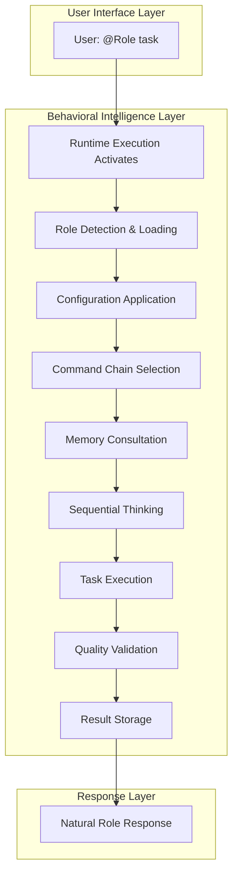
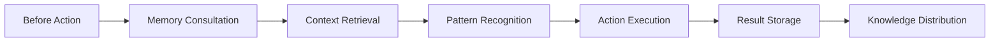
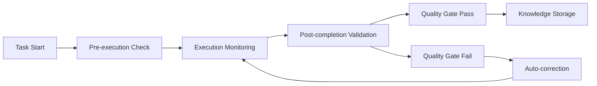

# Behavioral Intelligence Architecture

**Streamlined behavioral framework for professional AI collaboration**

## Architectural Overview

The Behavioral Intelligence system has been consolidated from a complex enforcement hierarchy into a streamlined two-behavior architecture that provides all the coordination, quality, and consistency benefits while being easier to understand and more reliable in operation.

## Core Architecture Principles

### Simplicity Through Consolidation
- **Previous**: 17 separate behavioral files with overlapping responsibilities
- **Current**: 2 core behaviors with clear, distinct responsibilities
- **Benefit**: Reduced complexity, easier maintenance, better performance

### Transparent Operation
- **Previous**: Complex enforcement hierarchies requiring user understanding
- **Current**: Behavioral intelligence operates invisibly behind natural @-role interaction
- **Benefit**: Natural user experience with professional outcomes

### Quality Through Structure
- **Previous**: Multiple validation layers with potential conflicts
- **Current**: Built-in quality patterns within behavioral execution
- **Benefit**: Consistent quality without overhead

## Two-Behavior Architecture

### 1. Runtime Execution Behavior

**Purpose**: Foundation layer that enables all role interaction and coordination

**Responsibilities**:
- Automatic role detection and activation
- Configuration loading and enforcement
- Memory integration protocols
- Team coordination enablement
- Continuous operation management

**Activation**: Triggers immediately on any @-role interaction

**Technical Implementation**:
```markdown
Location: src/behaviors/runtime-execution.md
Import: @~/.claude/behaviors/runtime-execution.md
Scope: Session-wide, always active
Dependencies: Configuration, Memory MCP, Role definitions
```

**Key Capabilities**:
- **Role Detection Engine**: Scans every message for @-notation patterns
- **Dynamic Specialist Generation**: Creates domain experts on demand
- **Configuration Integration**: Loads and applies user settings
- **Memory-First Enforcement**: Ensures knowledge consultation and storage
- **Quality Gate Automation**: Built-in validation for all deliverables
- **Team Support Enablement**: Collaborative assistance protocols

### 2. Command Chain Behavior

**Purpose**: Structured process layer that ensures consistent role execution

**Responsibilities**:
- Role-specific execution patterns
- Memory consultation protocols
- Sequential thinking requirements
- Parallel delegation coordination
- Quality validation workflows

**Activation**: Triggered by role type and task complexity

**Technical Implementation**:
```markdown
Location: src/behaviors/command-chains.md
Import: @~/.claude/behaviors/command-chains.md
Scope: Per-role execution
Dependencies: Runtime Execution, Memory, Sequential Thinking
```

**Role-Specific Chains**:
- **PM Chain**: Strategic analysis → Parallel delegation → Progress tracking
- **Architect Chain**: Technical analysis → Design solution → Security validation
- **Developer Chain**: Implementation approach → Expert execution → Quality validation
- **Requirements-Engineer Chain**: Context gathering → Artifact creation → Completeness validation
- **Security-Engineer Chain**: Threat assessment → Control implementation → Compliance validation
- **QA-Engineer Chain**: Test planning → Test creation → Validation execution

## Behavioral Flow Architecture



## Integration Architecture

### Memory Integration


### Parallel Coordination
```mermaid
graph TD
    A[PM Strategic Analysis] --> B[Parallel Task Creation]
    B --> C[@Developer Task]
    B --> D[@Architect Task]
    B --> E[@QA-Engineer Task]
    B --> F[@Security-Engineer Task]
    C --> G[Memory Updates]
    D --> G
    E --> G
    F --> G
    G --> H[Progress Aggregation]
```

### Quality Assurance Flow


## Configuration Integration

### Runtime Configuration
The behavioral intelligence system respects user configuration settings:

```yaml
blocking_enabled: false          # Team collaboration mode
pm_always_active: true          # PM coordination available
team_maturity_level: "L3"       # Autonomous operation
memory_integration: true        # Mandatory memory usage
```

### Behavioral Adaptation
- **L3 Autonomy**: Continuous operation with strategic decision making
- **Team Collaboration**: Non-blocking quality assistance
- **Memory-First**: Mandatory knowledge consultation and storage
- **Quality Gates**: Built-in validation without interruption

## Performance Architecture

### Efficiency Optimizations
1. **Single Activation Path**: Runtime Execution provides single entry point
2. **Lazy Loading**: Command chains load only when needed
3. **Cached Configuration**: Settings loaded once per session
4. **Parallel Execution**: Multiple roles work simultaneously
5. **Memory Optimization**: Efficient knowledge storage and retrieval

### Scalability Patterns
- **Role Multiplication**: Multiple instances of same role type
- **Dynamic Specialists**: Unlimited domain expert generation
- **Workstream Parallelization**: Independent execution tracks
- **Memory Persistence**: Knowledge builds over time

## Error Handling Architecture

### Graceful Degradation
1. **Memory Unavailable**: Continues with built-in knowledge + warning
2. **Sequential Thinking Issues**: Falls back to standard execution
3. **Quality Gate Failures**: Auto-correction workflows activate
4. **Role Conflicts**: Automatic role reassignment

### Recovery Mechanisms
- **Configuration Fallback**: Default settings if config unavailable
- **Tool Fallback**: Context7 → Brave Search → Built-in knowledge
- **Role Replacement**: Automatic at -10 professionalism score
- **Memory Recovery**: Relationship rebuilding from stored entities

## Monitoring and Observability

### Performance Metrics
- **Response Time**: Behavioral execution efficiency
- **Quality Scores**: P (process) and Q (quality) tracking
- **Memory Utilization**: Knowledge consultation and storage rates
- **Parallel Efficiency**: Multi-role coordination success

### Learning Analytics
- **Pattern Recognition**: Successful behavioral combinations
- **Improvement Tracking**: Quality score evolution over time
- **Team Dynamics**: Role interaction effectiveness
- **Knowledge Growth**: Memory system expansion patterns

## Security Architecture

### Behavioral Security
- **Configuration Validation**: Settings schema enforcement
- **Memory Isolation**: Role-specific knowledge boundaries
- **Quality Gates**: Security validation in all workflows
- **Audit Trails**: Behavioral execution logging

### Access Control
- **Role Boundaries**: Clear responsibility separation
- **Memory Access**: Entity-based permission model
- **Configuration Protection**: User setting integrity
- **Tool Permissions**: Graduated access levels

## Extension Architecture

### Adding New Behaviors
1. Define behavior purpose and scope
2. Create markdown specification
3. Integrate with runtime execution
4. Test with role interactions
5. Document usage patterns

### Modifying Existing Behaviors
1. Maintain compatibility with runtime execution
2. Preserve command chain integration
3. Test across all role types
4. Update architecture documentation

### Custom Role Integration
1. Define role command chain
2. Integrate with behavioral patterns
3. Test memory and quality integration
4. Document role capabilities

## Future Architecture Considerations

### Scalability Enhancements
- **Distributed Memory**: Multi-node knowledge systems
- **Advanced Analytics**: ML-based behavioral optimization
- **Custom Behaviors**: User-defined behavioral patterns
- **Enterprise Integration**: SSO and policy enforcement

### Intelligence Evolution
- **Adaptive Behaviors**: Self-modifying execution patterns
- **Predictive Coordination**: Anticipatory role activation
- **Context Awareness**: Environmental behavioral adaptation
- **Learning Acceleration**: Faster pattern recognition

## Conclusion

The streamlined Behavioral Intelligence Architecture provides a robust, efficient, and maintainable foundation for professional AI collaboration. By consolidating complex enforcement hierarchies into two essential behaviors, the system delivers all the coordination, quality, and consistency benefits while being easier to understand, modify, and extend.

The architecture's focus on transparency, automation, and natural interaction ensures that users can leverage sophisticated AI collaboration capabilities through simple @-role addressing while the system handles all quality, coordination, and learning aspects automatically.