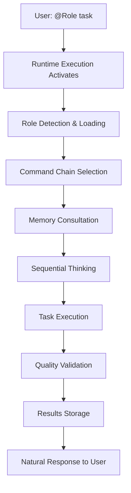

# Behavioral Intelligence Guide

**Transform AI collaboration through streamlined behavioral patterns**

## Overview

Behavioral Intelligence is the core framework that makes virtual team coordination possible. It operates through two essential behaviors that execute automatically when you interact with @-roles, creating consistent, high-quality outcomes without requiring manual intervention.

## Core Behavioral Architecture

### Two Essential Behaviors

The system has been streamlined to focus on two critical behavioral patterns:

#### 1. Runtime Execution Behavior
- **Purpose**: Automatic activation and coordination of all role interactions
- **Activation**: Triggers immediately when any @-role is addressed
- **Functions**: Role detection, expertise loading, memory consultation, quality validation
- **Location**: `src/behaviors/runtime-execution.md`

#### 2. Command Chain Behavior  
- **Purpose**: Structured process execution for consistent role performance
- **Activation**: Executes specific chains based on role type and task complexity
- **Functions**: Memory-first protocols, sequential thinking, parallel delegation, quality gates
- **Location**: `src/behaviors/command-chains.md`

### How It Works

When you address any role (e.g., `@PM Build a portfolio website`):

1. **Runtime Execution** activates immediately
2. **Command Chain** for that role type begins execution
3. All behavioral patterns run automatically in the background
4. You see natural role responses while quality patterns ensure excellence

## Behavioral Intelligence Flow



## Key Behavioral Patterns

### Memory-First Culture
Every action automatically includes:
- Memory consultation before decisions
- Context retrieval from previous work
- Pattern recognition from team history
- Knowledge storage after completion

### Sequential Thinking
Complex tasks automatically trigger:
- Structured problem analysis
- Multiple solution evaluation
- Strategic approach selection
- Implementation planning

### Parallel Coordination
PM automatically creates:
- Multiple simultaneous workstreams
- Independent role assignments
- Progress tracking across team
- Integrated result delivery

### Quality Gates
All work automatically includes:
- Pre-execution validation
- During-execution monitoring
- Post-completion verification
- Continuous improvement capture

## Behavioral Consolidation Benefits

### Simplified Architecture
- **Before**: 17 separate behavioral files with overlapping functionality
- **After**: 2 core behaviors with clear responsibilities
- **Result**: Easier to understand, maintain, and extend

### Reduced Complexity
- **Before**: Complex enforcement hierarchies and redundant patterns
- **After**: Streamlined execution with automatic quality assurance
- **Result**: More reliable performance, fewer edge cases

### Enhanced Performance
- **Before**: Multiple validation layers causing overhead
- **After**: Efficient behavioral patterns with built-in quality
- **Result**: Faster response times, smoother coordination

### Better User Experience
- **Before**: Users needed to understand behavioral complexity
- **After**: Natural @-role interaction with behavioral intelligence invisible
- **Result**: Easy adoption, professional outcomes

## Behavioral Pattern Examples

### Simple Task: `@Developer Add a login button`
```
1. Runtime Execution: Activates Developer role with expertise
2. Command Chain: Developer pattern executes
   - Memory check for UI patterns
   - Quick implementation thinking
   - Code creation with best practices
   - Quality validation
3. User sees: Clean implementation with proper patterns
```

### Complex Task: `@PM Build an e-commerce platform`
```
1. Runtime Execution: Activates PM with strategic capabilities
2. Command Chain: PM strategic pattern executes
   - Memory consultation for architecture patterns
   - Sequential thinking for platform requirements
   - Parallel delegation to multiple roles:
     * @Architect: System design
     * @Developer: Core features
     * @Security-Engineer: Payment security
     * @QA-Engineer: Testing framework
3. User sees: Coordinated team building complete platform
```

## Configuration Integration

Behavioral Intelligence respects your configuration settings:

### `blocking_enabled=false` (Default)
- Team collaboration mode active
- Continuous operation without interruption
- Peer support for behavioral excellence
- Non-blocking quality assistance

### `pm_always_active=true` (Default)
- PM coordination available immediately
- Strategic analysis on complex requests
- Automatic team delegation
- Progress tracking and reporting

### `team_maturity_level=L3` (Default)
- Autonomous technical decision making
- Continuous operation without prompting
- Strategic analysis layer active
- Advanced coordination patterns

## Troubleshooting Behavioral Intelligence

### If roles seem unresponsive:
1. Check that @-notation is used correctly
2. Verify configuration is loaded properly
3. Ensure memory system is accessible

### If quality seems inconsistent:
1. Behavioral patterns may need memory refresh
2. Check that sequential thinking is completing
3. Verify quality gates are executing

### If coordination feels disjointed:
1. PM role may need explicit activation
2. Parallel delegation patterns may need adjustment
3. Memory consultation may be incomplete

## Advanced Behavioral Customization

### Adding New Role Patterns
1. Define the role in `role-framework.md`
2. Create command chain in `command-chains.md`
3. Test behavioral integration
4. Document in team communication

### Modifying Existing Behaviors
1. Edit appropriate behavioral file
2. Maintain compatibility with runtime execution
3. Test with various task complexities
4. Update documentation examples

### Performance Tuning
1. Monitor behavioral execution efficiency
2. Adjust thinking requirements for task complexity
3. Optimize memory consultation patterns
4. Balance quality with response time

## Best Practices

### For Users
- Use clear @-role addressing for best results
- Provide context in task descriptions
- Let behavioral intelligence handle process details
- Trust the system's quality patterns

### For Customization
- Preserve core behavioral architecture
- Test changes thoroughly before deployment
- Document behavioral modifications
- Maintain backward compatibility

### For Team Coordination
- Allow parallel work streams to execute
- Trust memory-first culture for consistency
- Leverage sequential thinking for complex decisions
- Use natural language with @-role addressing

## Conclusion

Behavioral Intelligence transforms Claude Code into a professional development team through streamlined, automatic behavioral patterns. The two-behavior architecture provides all the coordination, quality, and consistency benefits of the previous complex system while being easier to understand and more reliable in operation.

The behavioral patterns operate transparently, allowing you to interact naturally with @-roles while ensuring professional development practices, continuous learning, and high-quality outcomes automatically.