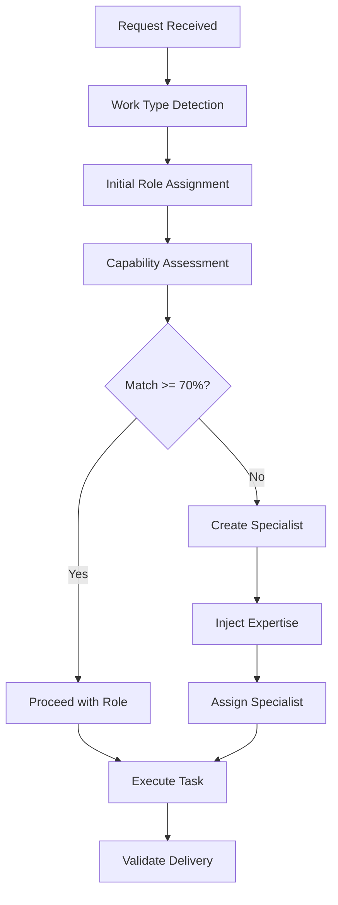

# Role Validation Technical Reference

## Validation Architecture

### Core Components

#### 1. Work Type Detection Engine
```pseudocode
FUNCTION detectWorkType(request):
    workTypes = []
    
    // Frontend Detection
    IF hasPatterns(request, ["UI", "React", "Vue", "CSS", "component"]):
        workTypes.append("frontend")
    
    // Backend Detection
    IF hasPatterns(request, ["API", "server", "database", "REST"]):
        workTypes.append("backend")
    
    // Infrastructure Detection
    IF hasPatterns(request, ["Docker", "K8s", "deploy", "CI/CD"]):
        workTypes.append("infrastructure")
    
    // Security Detection
    IF hasPatterns(request, ["auth", "encrypt", "security", "OWASP"]):
        workTypes.append("security")
    
    RETURN workTypes
END FUNCTION
```

#### 2. Capability Matching Algorithm
```pseudocode
FUNCTION calculateCapabilityMatch(role, requirements):
    matches = 0
    total = len(requirements)
    
    FOR req IN requirements:
        IF role.hasCapability(req):
            matches += 1
        ELSE IF role.hasRelatedCapability(req):
            matches += 0.7
        ELSE IF role.canLearn(req):
            matches += 0.3
    
    RETURN (matches / total) * 100
END FUNCTION
```

#### 3. Specialist Creation Logic
```pseudocode
FUNCTION createSpecialistIfNeeded(task, currentRole):
    match = calculateCapabilityMatch(currentRole, task.requirements)
    
    IF match < 70:
        specialist = {
            name: generateSpecialistName(task),
            base: currentRole.type,
            expertise: task.specificTechnologies,
            capabilities: enhanceCapabilities(currentRole, task)
        }
        
        // Inject domain knowledge via Context7
        specialist.knowledge = injectDomainExpertise(specialist)
        
        RETURN specialist
    ELSE:
        RETURN currentRole
END FUNCTION
```

### Validation Command Implementation

#### /validate-assignment Command
```pseudocode
COMMAND validateAssignment:
    INPUT: currentRole, currentTask
    
    PROCESS:
        1. requirements = extractRequirements(currentTask)
        2. workTypes = detectWorkType(currentTask)
        3. optimalRoles = findOptimalRoles(workTypes, requirements)
        4. currentMatch = calculateCapabilityMatch(currentRole, requirements)
        
        IF currentMatch >= 90:
            RETURN "Optimal assignment confirmed"
        ELSE IF currentMatch >= 70:
            RETURN "Acceptable assignment, proceeding"
        ELSE:
            newRole = createSpecialistIfNeeded(currentTask, currentRole)
            RETURN "Creating specialist: " + newRole.name
    
    OUTPUT: Validation result with match percentage
END COMMAND
```

### Work Type Detection Patterns

#### Frontend Patterns
```yaml
keywords:
  primary: [React, Vue, Angular, UI, UX, interface, component]
  secondary: [CSS, SCSS, styled-components, Tailwind, Material-UI]
  tertiary: [responsive, animation, accessibility, webpack]

file_patterns:
  - "*.jsx"
  - "*.tsx"
  - "components/*"
  - "*.css"
  - "*.scss"
  
context_clues:
  - "user interface"
  - "visual design"
  - "client-side"
  - "browser compatibility"
```

#### Backend Patterns
```yaml
keywords:
  primary: [API, server, database, REST, GraphQL, microservice]
  secondary: [Node.js, Python, Java, authentication, middleware]
  tertiary: [ORM, query, endpoint, controller, model]

file_patterns:
  - "controllers/*"
  - "models/*"
  - "routes/*"
  - "*.sql"
  - "api/*"
  
context_clues:
  - "server-side"
  - "data processing"
  - "business logic"
  - "integration"
```

#### Infrastructure Patterns
```yaml
keywords:
  primary: [Docker, Kubernetes, AWS, GCP, Azure, deploy]
  secondary: [CI/CD, Jenkins, GitHub Actions, Terraform]
  tertiary: [container, orchestration, scaling, monitoring]

file_patterns:
  - "Dockerfile"
  - "*.yml"
  - "*.yaml"
  - ".github/workflows/*"
  - "terraform/*"
  
context_clues:
  - "deployment"
  - "infrastructure as code"
  - "cloud architecture"
  - "DevOps"
```

### Capability Assessment Matrix

#### Match Score Calculation
| Capability Type | Weight | Score Contribution |
|----------------|--------|-------------------|
| Exact Match | 1.0 | 100% |
| Related Skill | 0.7 | 70% |
| Transferable | 0.5 | 50% |
| Learnable | 0.3 | 30% |
| No Match | 0.0 | 0% |

#### Threshold Definitions
| Score Range | Assignment Decision | Action |
|------------|-------------------|---------|
| 90-100% | Optimal | Proceed immediately |
| 70-89% | Acceptable | Proceed with monitoring |
| 50-69% | Suboptimal | Consider specialist |
| <50% | Poor Match | Create specialist |

### Specialist Generation Process

#### Naming Convention
```
@[Technology]-[BaseRole]
Examples:
- @React-Frontend
- @GraphQL-Backend
- @Kubernetes-DevOps
- @OAuth-Security
```

#### Knowledge Injection
1. **Base Knowledge**: Inherited from parent role
2. **Domain Expertise**: Injected via Context7
3. **Best Practices**: Added from knowledge base
4. **Tool Proficiency**: Specific to technology stack

### Validation Chain Execution



### Integration with Core Systems

#### Memory Integration
```pseudocode
FUNCTION storeValidationPattern(validation):
    pattern = {
        workType: validation.detectedType,
        assignedRole: validation.finalRole,
        matchScore: validation.score,
        outcome: validation.result
    }
    
    memory.createEntity("Validation-Pattern", pattern)
    memory.createRelation(pattern, validation.task, "validated-for")
END FUNCTION
```

#### Quality Gate Integration
```pseudocode
FUNCTION validateRoleDelivery(role, deliverable):
    IF role.type != deliverable.expectedExpertise:
        RAISE "Role mismatch in delivery"
    
    IF deliverable.quality < role.expectedQuality:
        RAISE "Quality below role standards"
    
    RETURN validated
END FUNCTION
```

### Troubleshooting Validation Issues

#### Common Issues and Solutions

1. **False Positive Detection**
   - Symptom: Wrong work type detected
   - Cause: Ambiguous keywords
   - Solution: Enhanced context analysis

2. **Specialist Proliferation**
   - Symptom: Too many specialists created
   - Cause: Over-sensitive thresholds
   - Solution: Adjust capability weights

3. **Validation Loop**
   - Symptom: Repeated re-assignments
   - Cause: Borderline capability scores
   - Solution: Implement assignment history

### Performance Optimization

#### Caching Strategy
```pseudocode
validationCache = {
    key: hash(workType + requirements),
    value: optimalRole,
    ttl: 3600 // 1 hour
}
```

#### Batch Validation
```pseudocode
FUNCTION batchValidate(tasks):
    validations = []
    
    FOR task IN tasks:
        validation = validateAssignment(task)
        validations.append(validation)
    
    optimizeAssignments(validations)
    RETURN validations
END FUNCTION
```

### Metrics and Monitoring

#### Validation Metrics
- Assignment accuracy rate
- Specialist creation frequency
- Average capability match scores
- Re-assignment occurrences

#### Quality Metrics
- Delivery success rate by role
- Time to completion by assignment type
- Error rates by role match percentage

### Future Enhancements

1. **Machine Learning Integration**
   - Learn from successful assignments
   - Predict optimal roles based on patterns
   - Adaptive threshold adjustment

2. **Multi-Role Orchestration**
   - Complex task decomposition
   - Parallel role coordination
   - Dependency management

3. **Expertise Evolution**
   - Role skill development tracking
   - Dynamic capability updates
   - Team expertise optimization